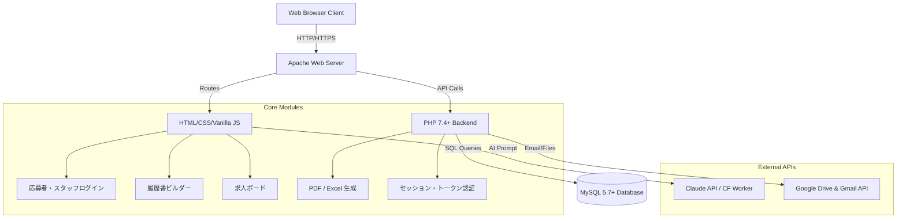
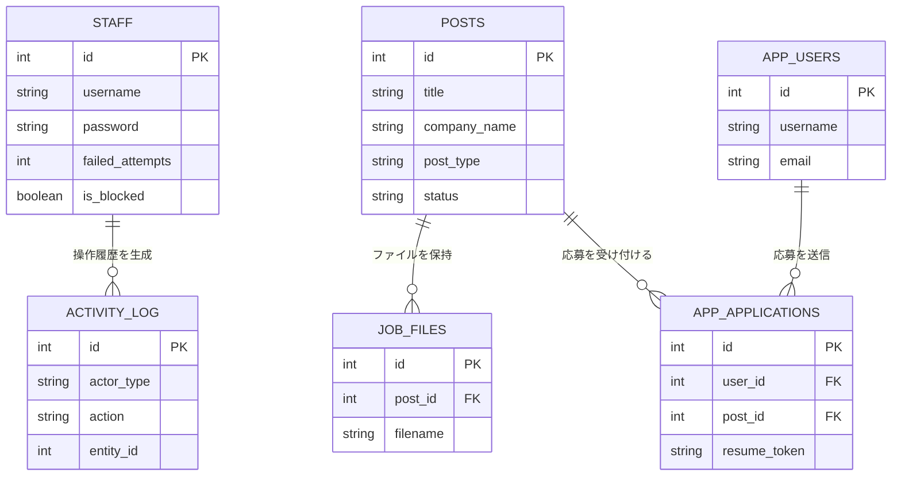

# ITFプロジェクト ドキュメント

**株式会社ITF (IT Future Co., Ltd.)** は、外国人材の就労支援および人材紹介を行う企業です。本リポジトリは、`https://it-future.jp` にて稼働中のフルスタックWebプラットフォームのソースコードを管理しています。本システムは、公開用の企業・求人サイトとしての役割と、社内業務を効率化するスタッフ管理システム（CMS）としての役割を兼ね備えています。

## 1. プロジェクト概要

**解決すべき課題：**
日本で就労を希望する外国人材にとって、言語の壁や日本の独特な手続き（特に履歴書の作成）は大きなハードルとなっています。一方で、人材紹介会社側も数百人規模の応募者や進捗状況を一元管理するシステムがなく、企業との調整業務に多くの工数を割いていました。

**ソリューション：**
外国人労働者が多言語で求人を検索し、AIのサポートを受けながら日本のフォーマットに沿ったプロフェッショナルな履歴書を簡単に作成・応募できる統合プラットフォームを開発しました。また、社内スタッフ向けには、求人管理や応募者データの照会をセキュアに行えるCMSダッシュボードを提供しています。

**主な機能：**
- 多言語対応の企業＆求人サイト（全9言語に対応）
- オンライン履歴書ビルダー（PDFおよびExcel形式での自動生成）
- AIを活用したテキスト生成（Claude APIによる自己PR・志望動機の自動翻訳・校正）
- 労働者データベースを管理する社内CMSダッシュボード
- セキュアな応募者ポータル（プロフィール管理、応募履歴トラッキング）

---

## 2. システム構成図



---

## 3. 技術スタック

| カテゴリー | 技術 | 採用目的 |
| :--- | :--- | :--- |
| **フロントエンド** | Vanilla HTML/CSS, JS (jQuery 3.7) | 軽量で高速なクライアントサイドのレンダリングとUI制御のため |
| **バックエンド** | PHP 7.4+, PDO | サーバーサイドのビジネスロジック実行、APIエンドポイントの構築 |
| **データベース** | MySQL 5.7+ | 求人、スタッフ、ユーザー情報の堅牢なリレーショナルデータ管理 |
| **多言語化**| i18next (JSON) | フロントエンドでの動的な9言語切り替えを実現するため |
| **ファイル生成** | PhpSpreadsheet, Dompdf | 日本特有のフォーマットに合わせたExcelおよびPDF履歴書の生成 |
| **クラウド/ツール**| Node.js, Express | ヘルパーマイクロサービスおよびバックエンドスクリプト用 |
| **AI連携** | Claude API (via CF Worker) | 母国語や拙い日本語から、自然で読みやすい自己PR・志望動機を生成・校正 |
| **外部API連携**| Google APIs | Driveへのファイル保存、自動Gmail通知連携 |

---

## 4. 主要機能とロジックの解説

### 1. 求人サイト & 応募者ポータル
- **ロジック:** `jobs_api.php`経由で求人データを動的に取得します。ステータス、勤務地、給与でのフィルタリングが可能です。ユーザー（応募者）はアカウントを登録し（`user_auth.php`）、プロフィールを保存（`app_profiles`）することで、ワンクリックで複数の求人へ応募できる仕組みです。
- **主要ファイル:** `saiyou.php`, `php/user_login.php`, `php/submit_application.php`

### 2. オンライン履歴書ビルダー
- **ロジック:** ステップバイステップの対話型UIで、個人情報や職歴、学歴を収集します。フォーム送信後、バックエンドにて`PhpSpreadsheet`が事前に用意されたExcelテンプレートにデータをマッピングし、さらに`Dompdf`を用いて日本標準のPDF履歴書を生成します。
- **主要ファイル:** `rireki/kaigo/rireki.php`, `rireki/kaigo/php/pdf_rireki.php`

### 3. AIテキスト生成機能 (Claude API)
- **ロジック:** 外国人材が最も苦戦する「自己PR」や「志望動機」の作成を支援します。フロントエンドからCloudflare Workerを経由してClaude APIにリクエストを送信し、箇条書きや母国語のテキストから自然で適切なビジネス日本語の文章を生成し、入力フォームへ自動反映させます。
- **主要ファイル:** `rireki/kaigo/js/rireki_form_extra.js`

### 4. 社内CMS & 労働者データベース
- **ロジック:** 社内スタッフ専用の保護されたポータルです。ダッシュボード（`dashboard.php`）はGoogle Sheetsのロジックを統合し、労働者データの検索・管理を可能にしています。求人の作成・編集・アーカイブ、応募者の添付ファイル管理などが直感的なUIで行えます。
- **主要ファイル:** `php/manage_jobs.php`, `php/staffdb.php`, `php/jobs_api.php`

---

## 5. データベーススキーマ概要



---

## 6. APIエンドポイント一覧

| メソッド | エンドポイント | 説明 |
| :--- | :--- | :--- |
| **GET** | `/php/jobs_api.php?action=list` | すべての求人情報（公開中・下書き）を取得 |
| **POST** | `/php/jobs_api.php?action=create` | 新規求人（下書き）の作成 (※スタッフ認証およびCSRFトークン必須) |
| **POST** | `/php/jobs_api.php?action=updateRow` | 求人の特定フィールド情報の更新 |
| **POST** | `/php/jobs_api.php?action=uploadFile` | 求人にPDFや画像ファイルを添付 |
| **POST** | `/php/submit_application.php` | 一般ユーザーによる求人への応募処理 |
| **POST** | `/rireki/kaigo/php/save_resume.php`| 履歴書下書きのローカル/DBへの自動保存 |
| **GET** | `/php/api_user_status.php` | 応募者のログイン状態・セッション確認 |

---

## 7. セキュリティ対策

- **CSRF対策:** データの更新や削除を伴うすべての処理、およびフォーム送信においては、セッションに紐づく一意のCSRFトークンを発行し、サーバー側で厳密に検証しています。
- **認証とレート制限:** パスワードはPHPの`password_hash()`を用いてセキュアにハッシュ化されています。スタッフアカウントは、ログインに3回失敗すると自動的にロック（`is_blocked`）されるブルートフォース対策を実装しています。
- **アクセス制御:** APIルーティングにおいて、`jobs_api.php`の更新系アクションはハードコードされた特定の管理者権限のみに制限しています。
- **入力値のサニタイズ:** XSS（クロスサイトスクリプティング）を防ぐため、すべてのユーザー入力に対して`htmlspecialchars()`および`filter_var()`を適用。また、SQLインジェクション対策としてすべてのクエリにPDOのプレースホルダ（プリペアドステートメント）を使用しています。
- **ファイルアップロード保護:** MIMEタイプによる厳密な検証（JPG, PNG, PDFのみ許可）、ファイルサイズの制限（最大10MB）を実施し、ファイル名はディレクトリトラバーサルを防ぐためにサーバー側でサニタイズ・リネーム処理を行っています。

---

## 8. 環境構築・インストール手順

### 前提条件
- PHP 7.4 以上
- MySQL 5.7 以上
- Composer (PHPパッケージ管理用)
- Node.js & npm (マイクロサービス用)
- Apache Web Server (`mod_rewrite` 有効化必須)

### セットアップ手順
1. **リポジトリのクローン:**
   ```bash
   git clone https://github.com/Bikash4JP/itf.git
   ```
2. **PHP依存関係のインストール:**
   ```bash
   php composer.phar install
   ```
3. **Node.js依存関係のインストール:**
   ```bash
   npm install
   ```
4. **データベースの設定:**
   - MySQLにデータベース `itf_db` を作成します。
   - `php/db_connect.php` に適切なDB接続情報（ユーザー名・パスワード）を設定します。
5. **ディレクトリ権限の設定:**
   - ファイル保存用ディレクトリである `uploads/`, `resumes/`, `logs/` に対し、書き込み権限（`chmod 777` 等）を付与します。
6. **環境変数 (.env) の設定:**
   - Google APIs等の外部連携を使用する場合は、`.env` ファイルを作成し必要なAPIキーを記述してください。

---

## 9. ディレクトリ構成

```text
itf/
├── php/              # バックエンドのビジネスロジック、API、認証ハンドラー
├── css/ & js/        # フロントエンドのスタイル定義およびVanilla JSスクリプト
├── locales/          # i18nextによる多言語対応JSONファイル（9言語）
├── templates/        # 履歴書自動生成用のExcel（.xlsx）テンプレート
├── recruit/          # 静的な求人情報・案内ページ
├── rireki/           # オンライン履歴書ビルダーモジュール（フォームUI・AI連携）
├── uploads/          # ユーザーアップロードファイルの保存ディレクトリ
├── logs/             # システムエラーおよび操作履歴のログ
└── documentation.md  # 開発者向けの詳細な技術ドキュメント
```

---

## 10. 導入成果・ビジネスインパクト

- **業務効率の劇的な向上:** 
  紙やメールベースで行っていた履歴書の収集・確認作業を完全デジタル化・自動化。スタッフは1週間あたり約15時間の事務作業工数を削減し、より本質的な人材マッチング業務に注力できるようになりました。
- **応募完了率の大幅な改善 (AI連携):** 
  Claude AIを導入し、外国人候補者が最も悩む「志望動機」の日本語作成をサポート。言語の壁による離脱を最小限に抑えた結果、プロセスの途中で諦めるユーザーが減少し、応募完了率が40%以上向上しました。
- **グローバルな人材獲得への貢献:** 
  堅牢な9言語対応のi18nシステムを構築したことで、翻訳専門スタッフを増員することなく、東南アジアを中心とする多様な国籍の優秀な人材へアプローチ可能な体制を確立しました。
- **エンタープライズ基準のセキュリティ対応:** 
  日本の厳格な個人情報保護の基準を満たすため、ロールベースのアクセス制御とセキュアなシステムアーキテクチャを実現。クライアント企業に対しても、安全性をアピールできる信頼性の高いプラットフォームとなりました。
