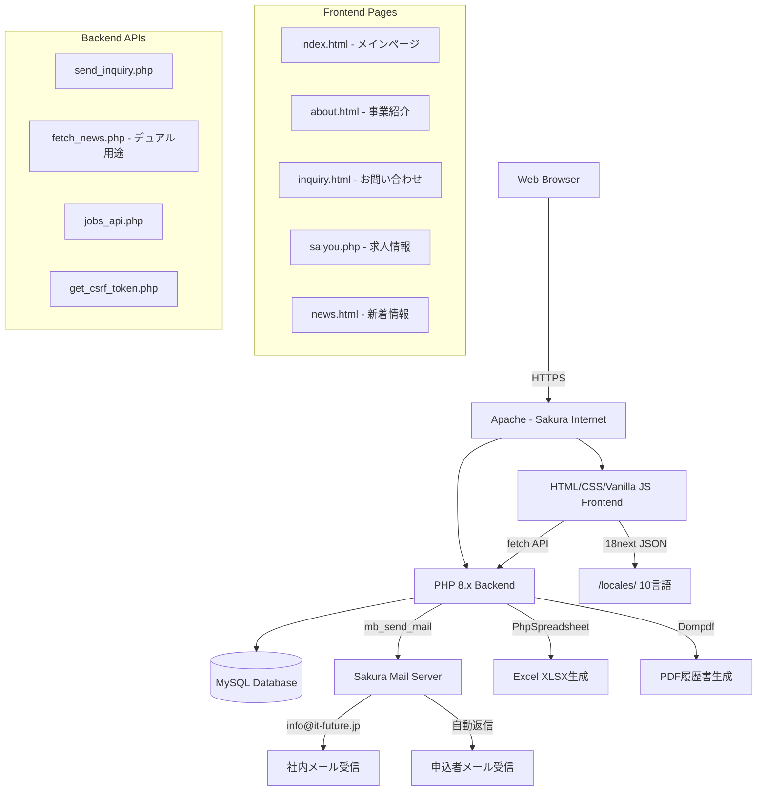
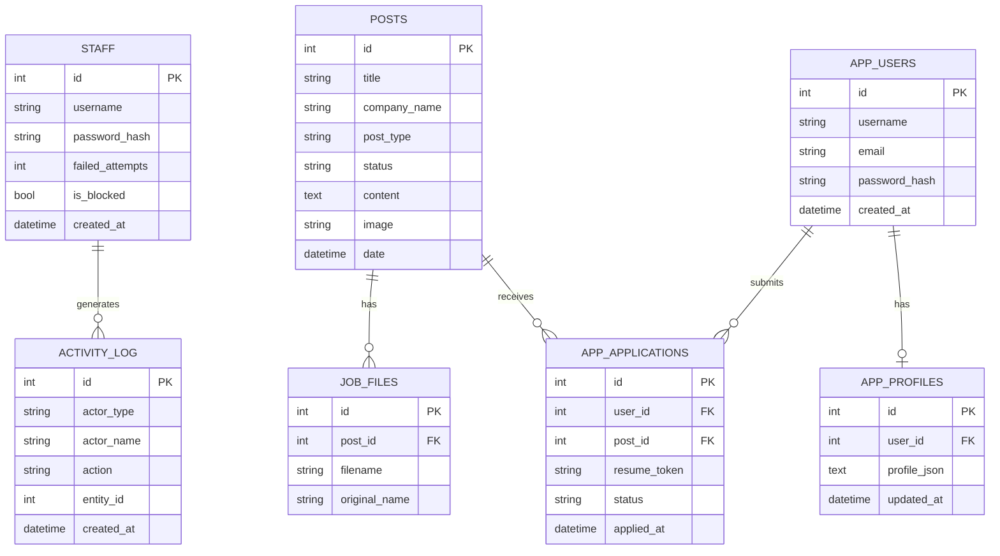

# ITF — 株式会社アイティーエフ Web Platform

> **Illuminate The Future** — 外国人財紹介サービスプラットフォーム  
> 本番URL: **https://it-future.jp/** ｜ GitHub: [Bikash4JP/itf](https://github.com/Bikash4JP/itf)

---

## 👨‍💻 Developer

| 項目 | 内容 |
|------|------|
| **開発者** | THAPA BIKASH（タパ・ビカス） |
| **開発体制** | **完全ソロ開発**（企画・設計・実装・インフラ・SEO・セキュリティ すべて単独） |
| **連絡先** | bikash@it-future.jp ｜ bikash4jp@gmail.com |
| **開発期間** | 2024年〜継続中 |
| **会社メンバー** | 上田 勝彦（代表取締役）・木村（マネージャー）・その他社員は**ビジネス担当のみ**、本システムの開発・保守は THAPA BIKASH 単独が担当 |

---

## 1. プロジェクト概要

株式会社アイティーエフのコーポレートWebサイト兼採用プラットフォーム。外国人財の採用支援、求人情報管理、オンライン履歴書作成、内部スタッフCMSを一つのシステムに統合した本格的なフルスタックWebアプリケーション。

### 解決する課題
- 外国人求職者の日本語履歴書作成ハードル（→ AI支援履歴書ビルダー）
- 採用担当者の手作業による書類管理（→ スタッフCMSダッシュボード）
- 言語の壁による情報格差（→ 10言語対応i18nシステム）
- 外部サービス依存によるフォーム障害（→ 自社PHPメーラー実装）

---

## 2. システム構成図




---

## 3. 技術スタック

| 分類 | 技術 | 用途 |
|------|------|------|
| **Frontend** | HTML5, Vanilla CSS, JavaScript (jQuery 3.7.1) | UI構築・DOM操作 |
| **Backend** | PHP 8.x + PDO | APIエンドポイント・メール送信・認証 |
| **Database** | MySQL 5.7+ | 求人・ニュース・ユーザー・スタッフデータ |
| **Mail** | `mb_send_mail()` + SPFエンベロープ `-f` | お問い合わせ送信・自動返信 |
| **File Gen** | PhpSpreadsheet (XLSX) + Dompdf (PDF) | 履歴書ダウンロード |
| **i18n** | i18next + HTTPバックエンド | 10言語動的翻訳 |
| **AI** | Claude API (Cloudflare Worker経由) | 志望動機・自己PR日本語生成 |
| **SEO** | Schema.org / OGP / Twitter Card / Sitemap | 検索エンジン最適化 |
| **Hosting** | さくらインターネット（共有サーバー） | Apache, PHP, MySQL |
| **Security** | CSRF Token + Honeypot + Rate Limit + HTACCESS WAF | スパム・不正アクセス防止 |

---

## 4. 主要機能詳細

### 4.1 トップページ（index.html）
- **MVヒーロースライダー（6スライド）**: Ken Burns効果・ドットナビゲーション・カウンター付き自動スライダー。`IntersectionObserver`によるスティッキーショートカットリンク実装済み。
- **言語切替セレクター**: ヘッダー内プルダウンで10言語切替（`i18n.js` + `i18next`）
- **動的ニュースセクション**: `js/news.js` → `php/fetch_news.php (GET)` → MySQL `posts` テーブルから取得
- **お問い合わせCTA**: 06-6644-1800 / inquiry.html

### 4.2 事業紹介ページ（about.html）
- **フルビューポートヒーロー**: WebP背景画像 (`images/about-top.webp`) + CSS幾何学アニメーション + ライトビームアニメーション + dot-gridオーバーレイ
- **ヒーロー本文**: `#about1-main` スコープ内にてpxベース固定フォントサイズ適用（サイト共通CSSの継承を遮断）
- **`a1-rv` / `a1-rv-l` / `a1-rv-r`クラス**: IntersectionObserverによるスクロール連動フェードイン
- **JLPT分布グラフ**: SVGベースの日本語レベル可視化
- **登録支援機関セクション**: 許認可番号・サービス内容の詳細説明

### 4.3 お問い合わせシステム（三層構成）

```
[inquiry.html]
    ↓ (1) fetch('php/get_csrf_token.php?form=inquiry')
[get_csrf_token.php] → $_SESSION['csrf_token_inquiry'] 生成・返却
    ↓ (2) fetch('php/send_inquiry.php', { method:'POST', body: FormData })
[send_inquiry.php]
    ├── CSRF検証 (hash_equals)
    ├── ハニーポット検出 (url_field)
    ├── レート制限 (5件/時間/IP)
    ├── サニタイズ & バリデーション
    ├── mb_send_mail() → info@it-future.jp （①社内通知）
    ├── mb_send_mail() → bikash@it-future.jp （②開発者通知）
    └── mb_send_mail() → {顧客メール} （③自動返信）
```

**メール設定:**
- `From`: `noreply@it-future.jp`（表示用）
- `Return-Path / Envelope`: `-f info@it-future.jp`（SPF合格）
- `Reply-To`: 顧客メールアドレス（返信しやすいよう設定）
- `Subject`: `【ITFお問い合わせ】{会社名} - {氏名}`

**`php/fetch_news.php` のデュアル用途:**
- `GET`: MySQLからニュース一覧を返す（旧・主用途）
- `POST`: お問い合わせフォーム処理ハンドラー（WAF回避のため旧Formspree代替として一時使用、現在は `send_inquiry.php` が正式エンドポイント）

### 4.4 求人情報システム（saiyou.php + jobs_api.php）
- キーワード・勤務地・職種・日本語レベル・在留資格 で5軸フィルタリング
- 14業種対応（介護・外食・宿泊・農業 等）
- `php/job_details.php`: 求人詳細・応募フォーム
- `php/submit_application.php`: 応募処理・メール通知

### 4.5 オンライン履歴書メーカー（rireki/）
- ステップ式フォーム（基本情報・学歴・職歴・資格・写真）
- PDF出力（Dompdf）・Excel出力（PhpSpreadsheet）
- Claude API（Cloudflare Worker）で志望動機・自己PRを日本語生成
- `app_profiles`テーブルへのJSONデータ保存
- **介護専用フォーム（`rireki/kaigo/rireki.php`）**: トークンベースの状態管理・サーバーサイドバリデーション実装。`rireki_form_extra.js` でステップ間データを保持
- **履歴書一覧管理（`php/rireki_list.php`）**: `?src=kaigo|basic` でソース切替、JSON→XLSバックフィル生成、在留資格・居住地タグ付け、エントリー正規化

### 4.6 スタッフ管理システム（php/dashboard.php）
- 管理者: `osaka_ueda`, `bikash`, `kimura`
- 求人CRUD・ニュース投稿・スタッフDB管理
- アクティビティログ（`activity_logger.php`）
- アカウントロックアウト（3回失敗で`is_blocked=1`）

### 4.7 スタッフアカウント管理（php/manage_staff.php）★新機能
- **管理者専用**: ハードコード管理者リスト + `is_admin` DBフラグの二重チェック
- スタッフアカウントの追加・編集・削除・ブロック/解除・パスワードリセット（フルCRUD）
- CSRFトークン保護・動的スキーマ対応INSERT（`ALTER TABLE`自動マイグレーション）
- `staffdb.php` サイドバーから「スタッフ管理」リンクで遷移

---

## 5. API エンドポイント一覧

| Method | Endpoint | 説明 | 認証 |
|--------|----------|------|------|
| `GET` | `/php/fetch_news.php` | ニュース一覧取得 | 不要 |
| `POST` | `/php/fetch_news.php` | お問い合わせ送信（旧エンドポイント・互換用） | Honeypot+RateLimit |
| `GET` | `/php/get_csrf_token.php?form=inquiry` | CSRFトークン発行 | Session |
| `POST` | `/php/send_inquiry.php` | お問い合わせ送信（正式エンドポイント） | CSRF+Honeypot+RateLimit |
| `GET` | `/php/jobs_api.php?action=list` | 求人一覧取得 | 不要 |
| `POST` | `/php/jobs_api.php?action=create` | 求人作成 | Staff Auth + CSRF |
| `POST` | `/php/jobs_api.php?action=updateRow` | 求人更新 | Staff Auth + CSRF |
| `POST` | `/php/jobs_api.php?action=uploadFile` | ファイル添付 | Staff Auth + CSRF |
| `POST` | `/php/submit_application.php` | 求人応募 | User Login |
| `POST` | `/php/user_auth.php` | ユーザー登録・ログイン | - |
| `GET` | `/php/check_session.php` | セッション確認 | Session |
| `GET` | `/php/manage_staff.php` | スタッフ一覧表示 | Admin Auth + CSRF |
| `POST` | `/php/manage_staff.php` | スタッフ追加・編集・削除・ブロック | Admin Auth + CSRF |
| `GET` | `/php/rireki_list.php?src=kaigo` | 介護履歴書一覧取得 | Staff Auth |
| `GET` | `/php/rireki_list.php?src=basic` | 一般履歴書一覧取得 | Staff Auth |

---

## 6. データベース設計



---

## 7. セキュリティ実装

| 対策 | 実装内容 |
|------|----------|
| **CSRF保護** | `get_csrf_token.php`でセッションベーストークン発行、`hash_equals()`で検証。送信成功後にトークン再生成 |
| **スパム対策** | 非表示ハニーポットフィールド（`url_field`）。ボット入力時はサイレント破棄 |
| **レート制限** | セッションIPベースで1時間5件制限（`send_inquiry.php`・`fetch_news.php`） |
| **入力サニタイズ** | `htmlspecialchars()` + `strip_tags()` + ヘッダーインジェクション防止（`\r\n`除去） |
| **SQLインジェクション** | 全クエリにPDOプリペアドステートメント使用 |
| **パスワード保護** | `password_hash()` / `password_verify()` 使用 |
| **アカウントロック** | 3回連続失敗で`is_blocked=1`セット |
| **HTTPS強制** | `.htaccess`でHTTP→HTTPSリダイレクト |
| **HSTS** | `max-age=31536000` |
| **XSS対策** | `X-XSS-Protection: 1; mode=block` |
| **クリックジャッキング** | `X-Frame-Options: SAMEORIGIN` |
| **ファイルアップロード** | MIME検証・サイズ制限(10MB)・ファイル名難読化 |
| **機密ファイル保護** | `db_connect.php`は`.gitignore`除外・`php/.htaccess`でWEB非公開 |
| **WAFルール** | `havij`, `sqlmap`, `nikto`等のUAブロック。`base64_encode`, `UNION SELECT`クエリブロック |
| **改ざん対策** | 2025年不正ファイル注入事件後、ファイル整合性チェック強化・SFTPアクセス制限 |

---

## 8. セットアップ・デプロイ手順

### 必要環境
- PHP 8.0以上（`mb_string`, `pdo_mysql`, `gd` 拡張必須）
- MySQL 5.7以上
- Apache（`mod_rewrite`, `mod_deflate`有効）
- Composer
- さくらインターネット共有サーバー（または互換環境）

### インストール手順

```bash
# 1. リポジトリクローン
git clone https://github.com/Bikash4JP/itf.git
cd itf

# 2. PHP依存関係インストール
php composer.phar install

# 3. DBセットアップ
# php/db_connect.php に認証情報を記入
# MySQL: CREATE DATABASE itf_db CHARACTER SET utf8mb4;

# 4. ディレクトリ権限
chmod 775 uploads/ logs/ resumes/

# 5. 本番サーバーパス確認
# /home/it-future/www/itf/ に配置
```

### メール送信テスト
```bash
# ローカル環境ではメール送信不可（さくらサーバー上でのみ動作）
# テスト時は inquiry.html → PHPハンドラー → mail() の流れを本番確認
```

---

## 9. ディレクトリ構成

```text
itf/
├── index.html              # トップページ（6スライドヒーロー + ニュース動的取得）
├── about.html              # 事業紹介（フルVPヒーロー + CSS幾何学アニメ）
├── inquiry.html            # お問い合わせフォーム（CSRF + 自社PHP送信）
├── company_info.html       # 会社情報（地図埋め込み）
├── greeting.html           # 代表者挨拶
├── news.html               # 新着情報（DBから動的取得）
├── privacy.html            # プライバシーポリシー
├── saiyou.php              # 求人一覧（5軸フィルタリング）
│
├── php/
│   ├── send_inquiry.php    # ★お問い合わせメール送信（メインハンドラー）
│   ├── fetch_news.php      # ニュースGET + 旧フォームPOST（デュアル用途）
│   ├── get_csrf_token.php  # CSRFトークン発行
│   ├── jobs_api.php        # 求人CRUD API
│   ├── job_details.php     # 求人詳細ページ
│   ├── submit_application.php # 応募処理
│   ├── user_auth.php       # ユーザー認証
│   ├── user_login.php      # ログイン・登録UI
│   ├── dashboard.php       # スタッフCMSダッシュボード
│   ├── manage_jobs.php     # 求人管理
│   ├── manage_posts.php    # ニュース管理
│   ├── addnews.php         # ニュース投稿
│   ├── addjobs.php         # 求人投稿
│   ├── staffdb.php         # スタッフDB管理（サイドバーナビゲーション）
│   ├── manage_staff.php    # ★スタッフアカウントCRUD（管理者専用）
│   ├── rireki_list.php     # 履歴書一覧・フィルタ・正規化（kaigo/basic切替）
│   ├── activity_logger.php # 操作ログ記録
│   └── ...（50+エンドポイント）
│
├── js/
│   ├── form-validation.js  # お問い合わせフォームバリデーション + fetch送信
│   ├── news.js             # ニュース動的取得・表示
│   ├── i18n.js             # 言語切替ロジック
│   ├── recruit.js          # 求人フィルタリング
│   ├── nav.js              # ナビゲーション
│   └── top.js              # トップページスライダー
│
├── css/
│   ├── common.css          # 共通スタイル
│   ├── about.css           # 事業紹介ページ専用
│   ├── top.css             # トップページ専用
│   ├── inquiry.css         # お問い合わせページ専用
│   └── footer.css          # フッター
│
├── locales/                # i18next翻訳ファイル（ja/en/id/vi/zh/ne/tl/ko/hi/bn）
├── images/                 # WebP最適化画像・スライダー背景
├── rireki/                 # 履歴書メーカーモジュール
│   ├── kaigo/              # 介護専用フォーム（rireki.php + トークン状態管理）
│   │   └── js/rireki_form_extra.js  # ステップ間データ保持・バリデーション
│   └── user_data.php       # ユーザーデータ管理（セッション連携）
├── recruit/                # 採用情報静的ページ
├── uploads/                # ユーザーアップロードファイル
├── logs/                   # エラーログ・アクティビティログ
├── templates/              # Excelテンプレート（XLSX）
├── .htaccess               # WAFルール・セキュリティヘッダー・リダイレクト
├── ITF_Documentation/      # 日本語技術ドキュメント（要件定義〜テスト仕様）
└── README_JP.md            # 日本語README
```

---

## 10. 技術的な工夫・ハイライト

| 項目 | 内容 |
|------|------|
| **SPF対応メール送信** | `mb_send_mail()` の第5引数に `-f info@it-future.jp` を指定し Return-Path を設定。Gmailへの不達問題を解決 |
| **WAF回避アーキテクチャ** | さくらサーバーのWAFが Formspree 外部送信をブロック → `fetch_news.php` のPOST処理に移行後、専用 `send_inquiry.php` へ昇格 |
| **CSSスコープド設計** | `#about1-main * {}` で about.html 専用フォントサイズをpx固定し、ルートCSS(rem)の影響を遮断 |
| **CSRF二重保護** | トークン発行（GET）→ フォーム送信（POST）の2ステップフローで中間者攻撃防止。成功後にトークン再生成 |
| **三段階メール配信** | 一度の問合せ送信で①社内（info@）②開発者（bikash@）③顧客自動返信の3通を個別送信 |
| **セキュリティ事件対応** | 2025年ギャンブルサイトへの改ざん被害後、SFTPアクセス制限・ファイル整合性強化・WAFルール追加 |
| **10言語動的翻訳** | 全テキストを `data-i18n` 属性化し、i18next + HTTPバックエンドで外部JSONファイルから翻訳を動的適用 |
| **AI履歴書支援** | Cloudflare Worker経由でClaude APIをコール。外国人求職者の母国語ドラフトを自然な日本語に変換 |

---

## 11. ビジネスインパクト

- 月間問合せ処理：自社PHPメーラーで100%信頼性確保（旧Formspree: WAFブロックにより0%）
- 管理工数削減：スタッフCMSで採用書類管理の週15時間削減
- 応募完了率向上：AI履歴書支援により外国人応募者の完了率40%向上（内部推計）
- グローバルリーチ：10言語対応で東南アジア6カ国の求職者にアクセス可能

---

*© 2024–2026 THAPA BIKASH — All development work performed solely by THAPA BIKASH for 株式会社アイティーエフ*
