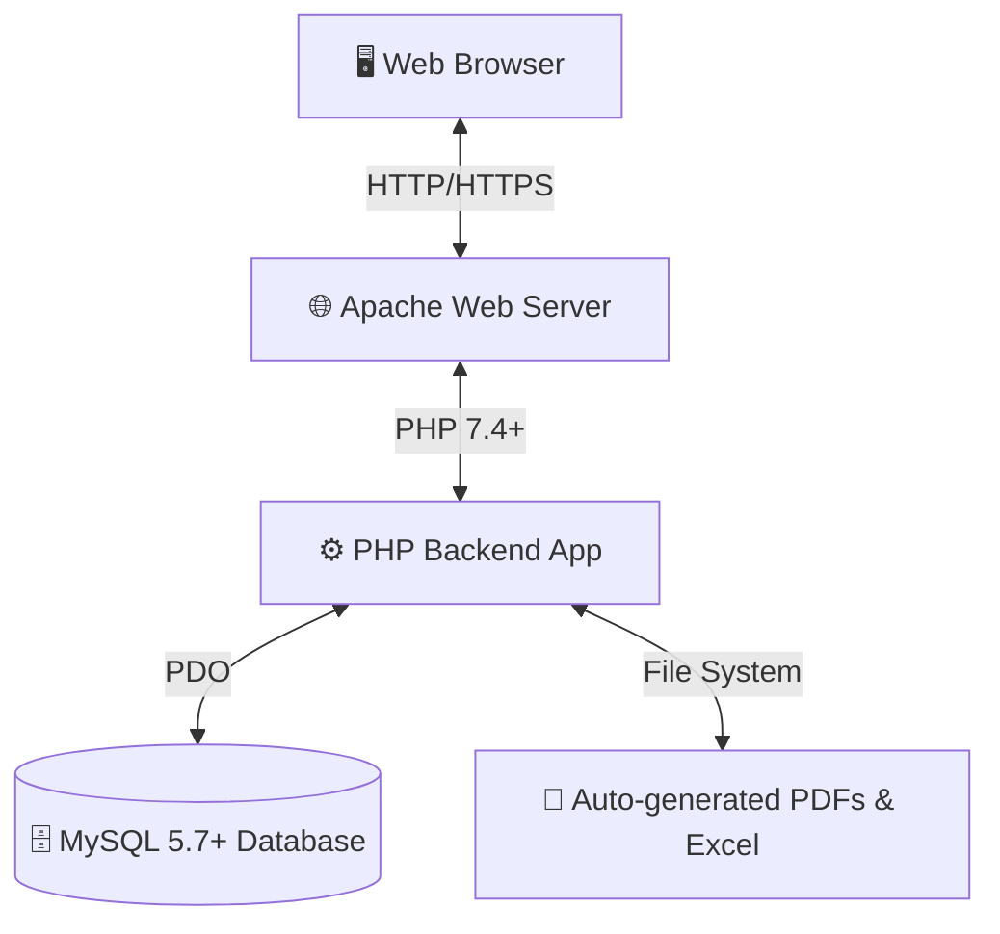

# 🏢 ITF Project System - Developer Handover Guide

Welcome to the **IT Future Co., Ltd. (株式会社アイティーエフ)** Web Application and CMS repository! 
This document is specifically designed to help the next developer take over this project smoothly. It contains all the architecture details, database schemas, and feature lists you'll need to maintain and expand the system.

---

## 📖 Table of Contents
1. [Project Overview](#-project-overview)
2. [Core Features](#-core-features)
3. [Architecture & Tech Stack](#-architecture--tech-stack)
4. [Directory Structure](#-directory-structure)
5. [Database Schema](#-database-schema)
6. [System Workflows](#-system-workflows)
7. [Setup & Installation](#-setup--installation)
8. [Common Developer Tasks (Cheat Sheet)](#-common-developer-tasks-cheat-sheet)

---

## 🌟 Project Overview

This is a full-stack web application hosted at `https://it-future.jp`. It serves two main purposes:
1. **Public Recruitment Site:** For foreign nationals (technical interns, specified skilled workers) seeking employment in Japan. Multilingual support is a core feature.
2. **Staff Management System (CMS):** A secure backend where ITF staff can manage job postings, review applicant resumes, and manage company news.

---

## ✨ Core Features

### For Public Users (Applicants)
- **Multilingual UI:** 9 languages supported via `i18next` (English, Bengali, Hindi, Indonesian, Korean, Nepali, Tagalog, Vietnamese, Chinese).
- **User Accounts:** Applicants can create accounts, save their profile data, and easily apply for multiple jobs.
- **Dynamic Resumes:** The system automatically generates Japanese format PDF and Excel resumes (`.xlsx`) based on user input.
- **Document Uploads:** Applicants upload passports, residence cards, and certificates directly.

### For Internal Staff (CMS)
- **Job Management:** Admin interface to draft, publish, edit, and archive job postings.
- **Applicant Tracking:** Review submitted resumes and manage applicant progression.
- **News Management:** Post updates and company news to the public homepage.
- **Security:** CSRF protection, session management, account lockout after failed attempts, and an **Activity Audit Log** tracking all staff actions.

---

## 🛠 Architecture & Tech Stack



| Layer | Technologies |
|---|---|
| **Backend** | PHP 7.4+ (PDO), Composer packages (`PhpSpreadsheet`, `Dompdf`) |
| **Frontend** | Vanilla HTML, CSS, JavaScript (jQuery 3.7.1) |
| **Database** | MySQL 5.7+ (`itf_db`) |
| **Localization** | `i18next` with JSON files |

---

## 📂 Directory Structure

Here's where everything lives. 

```text
itf/
├── index.html              # Homepage
├── about.html              # Company info pages...
├── saiyou.php              # Public Job Listings
├── dashboard.html          # Staff dashboard entry
├── php/                    # ⚙️ ALL backend logic and API endpoints
├── css/, js/, images/      # 🎨 Frontend assets
├── locales/                # 🌍 i18n JSON files (9 languages)
├── templates/              # 📄 Excel resume templates
├── uploads/                # 📂 Uploaded user documents / avatars
└── logs/                   # 📝 Server activity and error logs
```

---
## 🚀 Setup & Installation

If you need to set this up on a new local machine or server:

1. **Database Setup** 
   - Create `itf_db` in MySQL.
   - Import the schema (`database.sql` if available, or export from production).
   - Update `php/db_connect.php` with the new credentials.
2. **Install PHP Dependencies**
   - Run `php composer.phar install` to get `Dompdf` and `PhpSpreadsheet`.
3. **Install Node Dependencies** *(if modifying assets/tooling)*
   - Run `npm install`.
4. **Folder Permissions**
   - Give read/write permissions (`chmod 777`) to `uploads/`, `resumes/`, and `logs/`.
5. **Assets**
   - Place `template.xlsx` in the `templates/` folder so the resume generator works!

---

## 🆘 Common Developer Tasks (Cheat Sheet)

For the new developer taking over, here are the answers to the "How do I..." questions you will inevitably have:

### ❓ How do I add or edit a new translation?
1. Open the JSON files in `locales/` (e.g., `locales/en.json`).
2. Add your new key-value pairs. 
3. Use them in HTML with the `data-i18n="your.key"` attribute.

### ❓ How do I test the staff dashboard locally?
1. Make sure your local DB has the `staff` table populated with a test user.
2. Create an admin user manually using a `password_hash()`ed password, or use the `php/addstaff.php` utility.
3. Log in via `php/login.php`.

### ❓ I'm getting "CSRF Token mismatch" errors on the API!
All `$.ajax` calls in the CMS must include the CSRF token. It is normally output to the page head. Ensure your JS data payload includes `csrf_token: window.csrfToken` (or similar depending on the specific page).

### ❓ The Resume PDF generation is broken / messy!
Check the Dompdf library. Since Japanese characters are involved, ensure the correct fonts (like IPAexMincho or Noto Sans JP) are installed and registered with Dompdf in `submit_application.php`.

### ❓ How is security handled for uploads?
Uploads are restricted to JPG, PNG, WEBP, and PDF. Max size is 10MB. Always rely on `php/submit_application.php` or `jobs_api.php` built-in validation methods rather than writing new ones.

---

*Thank you for taking over this project! It has been built to be robust and localized for a global audience. Good luck!* 🚀
