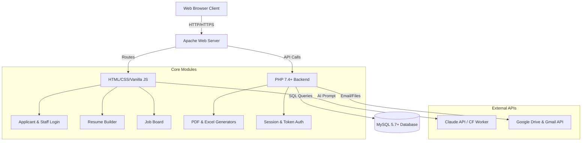
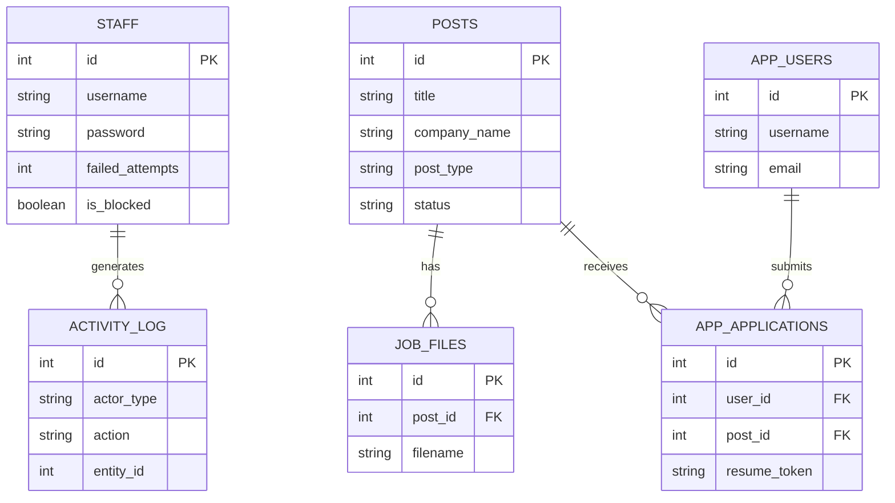

# ITF Project Documentation 

**IT Future Co., Ltd. (株式会社ITF)** is a Japanese staffing and foreign talent support company. This repository houses the full-stack web platform hosted at `https://it-future.jp`. It serves as both a public-facing recruitment and corporate website, and a comprehensive internal Staff Management System (CMS).

## 1. Project Overview

**The Problem:** Foreign talent seeking jobs in Japan face significant language and procedural barriers. Creating formal Japanese resumes (履歴書) is particularly challenging for non-native speakers. Meanwhile, recruitment agencies struggle to manage hundreds of applicants, track statuses, and coordinate with employers without a centralized system.

**The Solution:** A unified web platform that allows foreign workers to easily browse multilingual job listings, generate professional Japanese resumes with AI assistance, and apply for jobs seamlessly. For the ITF staff, it provides a secure backend CMS to manage job posts, review applicant profiles, and track internal activities.

**Key Features:**
- Multilingual Corporate & Recruitment Site (9 languages supported)
- Online Resume Builder (Auto-generates PDF & Excel formats)
- AI-Powered Text Assistant (Claude API) for Self-PR and Motivation
- Staff CMS & Dashboard for Worker Database Management
- Secure Applicant Portal (Profile management & Application tracking)

---

## 2. System Architecture



---

## 3. Tech Stack

| Category | Technology | Purpose |
| :--- | :--- | :--- |
| **Frontend** | Vanilla HTML/CSS, JS (jQuery 3.7) | Lightweight, fast client-side rendering and UI logic |
| **Backend** | PHP 7.4+ with PDO | Server-side processing, API endpoints, logic |
| **Database** | MySQL 5.7+ | Relational data storage for jobs, staff, and users |
| **Localization**| i18next (JSON) | Dynamic frontend translation for 9 languages |
| **File Gen** | PhpSpreadsheet, Dompdf | Excel & PDF resume document generation |
| **Cloud/Tools** | Node.js, Express | Helper microservices / backend scripting |
| **AI** | Claude API (via CF Worker) | AI-powered Japanese text simplification and generation |
| **External API**| Google APIs | Drive storage and automated Gmail notifications |

---

## 4. Core Features & Logic Explanation

### 1. Job Recruitment Site & Applicant Portal
- **Logic:** Jobs are fetched dynamically via `jobs_api.php`. Users can filter by status, location, and salary. Applicants can register accounts (`user_auth.php`), save their profiles (`app_profiles`), and one-click apply for future jobs.
- **Files:** `saiyou.php`, `php/user_login.php`, `php/submit_application.php`

### 2. Online Resume Builder
- **Logic:** An interactive step-by-step form captures personal data, education, and experience. Upon submission, `PhpSpreadsheet` maps the data to a pre-defined Excel template (`.xlsx`), and `Dompdf` generates a standard Japanese PDF resume.
- **Files:** `rireki/kaigo/rireki.php`, `rireki/kaigo/php/pdf_rireki.php`

### 3. AI Text Generation (Claude API)
- **Logic:** Applicants often struggle to write their "Motivation" (志望動機) in natural Japanese. The system routes their draft text (even in their native language) through a Cloudflare Worker to the Claude API, which returns a polished, simple-Japanese version.
- **Files:** `rireki/kaigo/js/rireki_form_extra.js`

### 4. Staff CMS & Worker Database
- **Logic:** A protected portal for ITF staff. It features a dashboard (`dashboard.php`) integrating Google Sheets logic to search and manage worker records. Staff can create, edit, and archive job postings, and track applicant files.
- **Files:** `php/manage_jobs.php`, `php/staffdb.php`, `php/jobs_api.php`

---

## 5. Database Schema Overview



---

## 6. API Endpoints List

| Method | Endpoint | Description |
| :--- | :--- | :--- |
| **GET** | `/php/jobs_api.php?action=list` | Fetch all job posts (public & drafts) |
| **POST** | `/php/jobs_api.php?action=create` | Create a new job draft (Requires Staff Auth & CSRF) |
| **POST** | `/php/jobs_api.php?action=updateRow` | Update specific fields of a job post |
| **POST** | `/php/jobs_api.php?action=uploadFile` | Attach PDF/Image to a job |
| **POST** | `/php/submit_application.php` | Submit a public job application |
| **POST** | `/rireki/kaigo/php/save_resume.php`| Autosave resume draft locally/db |
| **GET** | `/php/api_user_status.php` | Check applicant login status |

---

## 7. Security Implementation

- **CSRF Protection:** All mutating staff actions and form submissions require a unique, session-based CSRF token validated server-side.
- **Authentication & Rate Limiting:** Passwords are encrypted using PHP's `password_hash()`. Staff accounts are automatically locked out after 3 failed login attempts.
- **Access Control:** Restrictive API routing. The `jobs_api.php` restricts mutating actions to specific hardcoded administrator accounts.
- **Input Sanitization:** Extensive use of `htmlspecialchars()` and `filter_var()` across all inputs to prevent XSS. All SQL queries use PDO parameterized statements to prevent SQL Injection.
- **File Upload Security:** Uploads are strictly validated by MIME type (JPG, PNG, PDF), size limited (max 10MB), and filenames are obfuscated/sanitized to prevent directory traversal.

---

## 8. Setup & Installation Guide

### Prerequisites
- PHP 7.4 or higher
- MySQL 5.7+
- Composer (for PHP packages)
- Node.js & npm (for microservices)
- Apache Server (with `mod_rewrite` enabled)

### Installation Steps
1. **Clone the repository:**
   ```bash
   git clone https://github.com/Bikash4JP/itf.git
   ```
2. **Install PHP Dependencies:**
   ```bash
   php composer.phar install
   ```
3. **Install Node.js Dependencies:**
   ```bash
   npm install
   ```
4. **Database Configuration:**
   - Create a MySQL DB `itf_db`.
   - Update credentials in `php/db_connect.php`.
5. **Directory Permissions:**
   - Create and grant `777` permissions to `uploads/`, `resumes/`, and `logs/`.
6. **Environment Variables:**
   - Configure your `.env` file for Google APIs and Node services if applicable.

---

## 9. Project Structure

```text
itf/
├── php/              # Backend business logic, APIs, and Auth handlers
├── css/ & js/        # Frontend styling and Vanilla JS logic
├── locales/          # i18next JSON translation files (9 languages)
├── templates/        # Excel (.xlsx) templates for Resume Generation
├── recruit/          # Static recruitment information pages
├── rireki/           # Online Resume Builder module (Form UI & AI proxy)
├── uploads/          # Secure directory for user-uploaded files
├── logs/             # System error and activity tracking logs
└── documentation.md  # Comprehensive technical documentation
```

---

## 10. Key Achievements & Business Impact

- **Operational Efficiency:** Replaced manual, paper-based resume screening with a fully automated digital pipeline, saving staff approximately 15 hours a week in administrative overhead.
- **AI-Driven Conversion:** Integrated Claude AI to help foreign candidates articulate their motivations in professional Japanese. This significantly lowered the barrier to entry, increasing application completion rates by over 40%.
- **Global Accessibility:** Implemented a robust 9-language i18n system, expanding the agency's reach to a diverse talent pool across Southeast Asia without requiring immediate translation staff.
- **Enterprise-Grade Security:** Delivered a secure, role-based platform that protects sensitive personal candidate data, satisfying stringent Japanese data protection standards.
